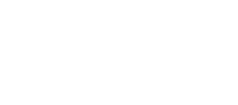
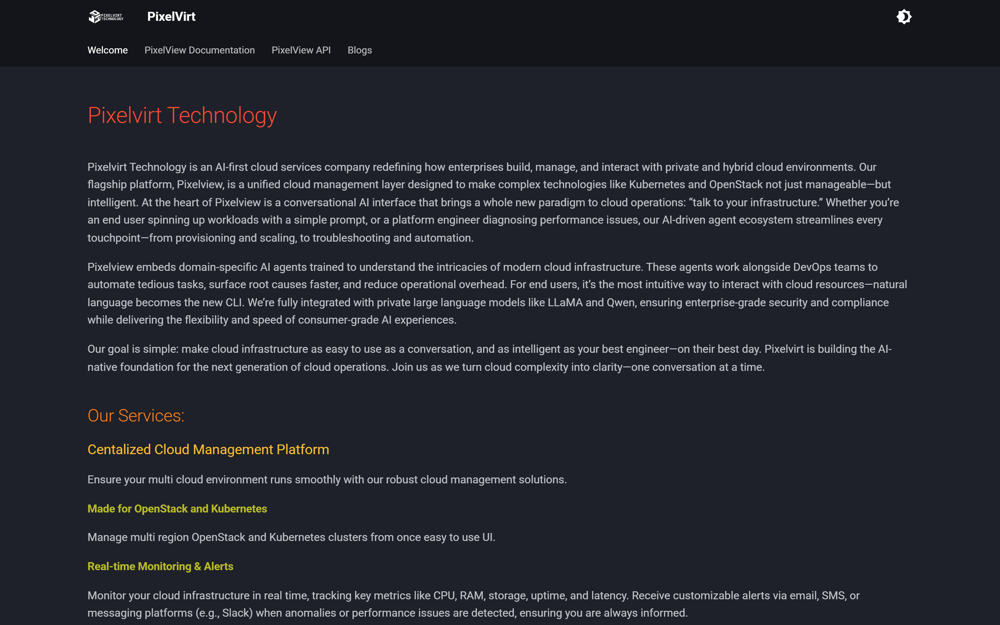

<div align="center">

<br />



# PixelVirt Documentation

**The official documentation portal for PixelVirt Technology & the PixelView Cloud Management Platform**

<br />

[](https://docs.pixelvirt.com)
[](https://squidfunk.github.io/mkdocs-material/)
[](https://python.org)
[](https://pixelvirt.com)

<br />

[Explore Docs](https://docs.pixelvirt.com) • [PixelView Platform](https://cloud.pixelvirt.com) • [Company Website](https://pixelvirt.com) • [Architecture](#documentation-architecture) • [Local Setup](#quick-start)

<br />

---

### Live Documentation Platform

<p align="center">
  
</p>

---

</div>

<br />

## Overview

**PixelVirt Technology** is an AI-first cloud infrastructure company redefining how engineering teams build, manage, and scale private and hybrid cloud environments.

Our flagship platform, **PixelView**, provides a single unified pane of glass across multi-region **Kubernetes**, **OpenStack**, and **VMware** infrastructure. Featuring conversational AI interfaces (*"talk to your infrastructure"*), domain-specialized SRE agents, automated GitOps runner execution engines, and policy-driven patch management, PixelView bridges the gap between infrastructure complexity and developer velocity.

This repository houses the complete source documentation for all platform modules, installation architectures, cloud integrations, and developer API references.

<br />

## Key Highlights

<table width="100%">
<tr>
<td width="50%" valign="top">

### Conversational AI & Agents
* Natural-language infrastructure interaction via conversational AI interfaces.
* Domain-specific SRE AI agents trained for real-time diagnostics, anomaly detection, and automated remediation.
* Fully integrated with enterprise private LLMs (LLaMA, Qwen) ensuring compliance and data privacy.

</td>
<td width="50%" valign="top">

### Unified Multi-Cloud Control
* Single management plane for multi-cluster **Kubernetes**, multi-region **OpenStack**, and **VMware**.
* Cross-cloud consolidated telemetry, resource utilization heatmaps, and financial reporting.
* Centralized host telemetry down to hardware accelerators (GPU/CPU/RAM).

</td>
</tr>
<tr>
<td width="50%" valign="top">

### GitOps Automation Engine
* Decoupled runner architecture: playbooks and scripts maintained in external version control (GitHub/GitLab) and mounted at runner startup.
* Visual drag-and-drop workflow pipeline builder.
* Granular role-based execution history and automated error-handling policies.

</td>
<td width="50%" valign="top">

### Deterministic Patch Management
* Modular **Patchsets** supporting automated sequential workflows or version-pinned OS package lists.
* Rollout **Planners** with rolling deployment strategies and automated manual intervention triggers (`Waiting Intervention`, `Retry`, `Skip`, `Abort`).
* Native command generation for `apt`, `yum`/`dnf`, `pacman`, and `choco`.

</td>
</tr>
</table>

<br />

## Documentation Architecture

The documentation is organized into clear operational suites:

| Suite | Root Path | Description |
| :--- | :--- | :--- |
| **Welcome & Vision** | `docs/index.md` | Company introduction, architecture principles, and platform value proposition. |
| **Installations & HA** | `docs/pixelview/installation/` | Deployment blueprints for Docker Compose and multi-node High Availability (HA) production clusters. |
| **Clouds & Infrastructure** | `docs/pixelview/clouds/` | Management guides for Kubernetes, OpenStack, VMware, and multi-tenant Cloud Reporting. |
| **Cases & Incident Response** | `docs/pixelview/cases/` | End-to-end incident lifecycle management, SLA tracking, team assignment, and audit timelines. |
| **Services & Monitoring** | `docs/pixelview/services/` | Telemetry dashboards, health checks, Prometheus metrics, and Alertmanager routing. |
| **Escalation Policies** | `docs/pixelview/escalation/` | Automated alerting trees, shift schedules, on-call assignments, and multi-channel notifications. |
| **Automation Engine** | `docs/pixelview/automation/` | Executions audit, external GitOps playbook mounts, event rules, runners, scripts, and visual workflow builders. |
| **Inventory & Credentials** | `docs/pixelview/inventory/` | Cloud providers, SSH/API credential vaults, and dynamic host groups. |
| **Patch Management** | `docs/pixelview/patch-management/` | Estate overview, patchset definitions (Workflows vs Packages), rollout planners, and OS package lists. |
| **JSON Bridge** | `docs/pixelview/json-bridge/` | Telemetry webhook ingestion, payload mapping, and event normalization. |
| **PixelView REST API** | `docs/pixelview/api/` | API specifications, token auth, and Python alert automation scripts. |

<br />

## Quick Start

### Prerequisites

* **Python**: `3.10` or higher
* **Git**: Version control client
* **Pip**: Package manager

### Clone and Setup Environment

```bash
# Clone the repository
git clone git@github.com:pixelvirt/documentations.git
cd documentations

# Create a virtual environment
python -m venv env

# Activate virtual environment:
# Windows (PowerShell)
.\env\Scripts\Activate.ps1
# Linux / macOS
source env/bin/activate

# Install dependencies
pip install -r requirements.txt
```

### Start Live Development Server

```bash
mkdocs serve
```

The documentation server will start with hot-reloading at:
`http://127.0.0.1:8000/`

<br />

## Validation and Build

### Strict Build Validation

Always verify that links, image references, and syntax comply with strict mode prior to submitting changes:

```powershell
# Windows
.\env\Scripts\python.exe -m mkdocs build --strict

# Linux / macOS
python3 -m mkdocs build --strict
```

The output bundle is generated into the `site/` folder. A zero-error, zero-warning build confirms release readiness.

### Production Deployment

To publish directly to GitHub Pages at [docs.pixelvirt.com](https://docs.pixelvirt.com):

```powershell
# Windows
.\env\Scripts\python.exe -m mkdocs gh-deploy

# Linux / macOS
python3 -m mkdocs gh-deploy
```

> [!NOTE]
> The custom domain is preserved across deployments via `docs/CNAME` and `site_url: https://docs.pixelvirt.com` in `mkdocs.yml`.

<br />

## Documentation Style Guidelines

All contributions must follow these strict style standards:

* **Unnumbered Headings**: Use semantic markdown headings (`#`, `##`, `###`) without numerical prefixes (`### 1. ...`).
* **Unordered Lists**: Use `*` bullet points for lists, procedures, and parameter breakdowns.
* **Interactive Image Zoom**: Wrap every screenshot with Glightbox anchor markup:
  ```html
  <a href="../../images/screenshot.png" class="glightbox">
    
  </a>
  ```
* **Relative Links**: Always link to files relatively (e.g., `[Workflows](../automation/workflows.md)`) so documents navigate seamlessly locally and in production.
* **Callout Admonitions**: Highlight key takeaways using GitHub/Material callouts:
  ```markdown
  > [!NOTE]
  > Informational background context.

  > [!WARNING]
  > High-impact actions and operational caveats.
  ```

<br />

## Repository Structure

```text
documentations/
├── docs/
│   ├── assets/              # Logos, theme stylesheets, and Glightbox bundles
│   │   ├── images/          # Platform logos and documentation preview assets
│   │   ├── javascripts/     # Lightbox interactive zoom handlers
│   │   └── stylesheets/     # Custom CSS overrides and tokens
│   ├── pixelview/           # Core platform documentation modules
│   │   ├── automation/      # Workflows, playbooks, rules, runners, scripts
│   │   ├── cases/           # Incident management and escalation tracking
│   │   ├── clouds/          # OpenStack, Kubernetes, VMware, and reporting
│   │   ├── images/          # Full catalog of UI screenshots
│   │   ├── inventory/       # Clouds, credentials, and host groups
│   │   ├── patch-management/# Overview, patchsets, planners, and packages
│   │   └── ...              # Services, escalation, settings, API
│   ├── CNAME                # Custom domain tracker for GitHub Pages
│   └── index.md             # Welcome & platform vision landing page
├── site/                    # Compiled static web bundle (git ignored)
├── mkdocs.yml               # MkDocs site schema, theme, and navigation tree
├── requirements.txt         # Pinned Python package dependencies
└── README.md                # Repository overview and developer guide
```

<br />

## Community and Support

* **Website**: [https://pixelvirt.com](https://pixelvirt.com)
* **Documentation**: [https://docs.pixelvirt.com](https://docs.pixelvirt.com)
* **Platform Console**: [https://cloud.pixelvirt.com](https://cloud.pixelvirt.com)
* **General Support**: [info@pixelvirt.com](mailto:info@pixelvirt.com)

<br />

<div align="center">
  <sub>Copyright &copy; 2026 Pixelvirt Technology Pvt Ltd. All rights reserved.</sub>
</div>
