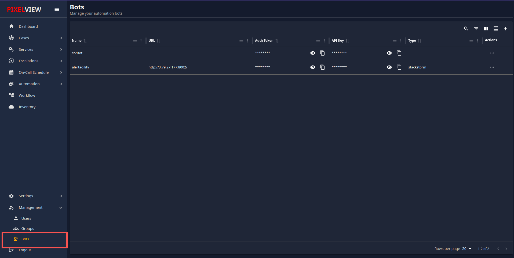
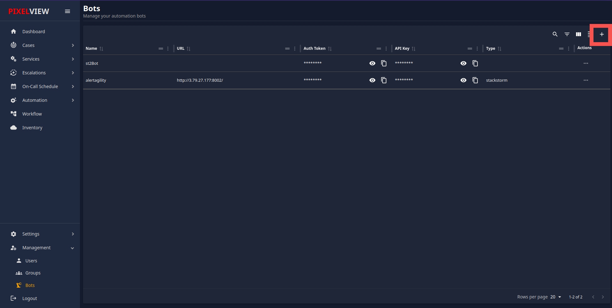
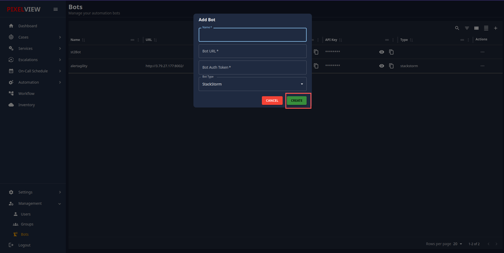
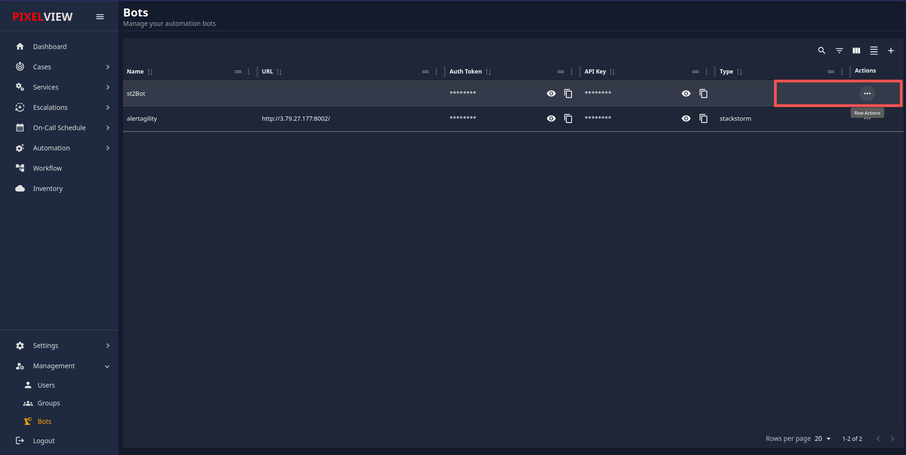

## Automation Bots in PixelView

### Overview

PixelView provides a user-friendly interface for managing automation bots. These bots help automate various tasks and integrate with other systems. This documentation will guide you through the process of adding and managing bots within PixelView.

### Prerequisites

Before you begin, ensure you have the following:

- Access to the PixelView interface.
- Necessary permissions to add and manage bots.
- Bot URL and authentication token for the bot you intend to add.

### Adding a New Bot

To add a new bot, follow these steps:

1. **Navigate to the Bots Section:**
    
    - From the PixelView dashboard, click on the "Bots" section in the left-hand menu.
    

2. **Open Add Bot Dialog:**
    - Click on the "+" icon or button to open the "Add Bot" dialog.
    
3. **Fill in Bot Details:**
    - **Name**: Enter a unique name for your bot.
    - **Bot URL**: Provide the URL where your bot can be reached. This should be a fully qualified domain name or IP address with the appropriate port number if necessary.
    - **Bot Auth Token**: Enter the authentication token that your bot uses to verify its identity.
    - **Bot Type**: Select the type of bot from the dropdown menu. Currently, "StackStorm" is a supported bot type.
4. **Create Bot:**
    - Click the "CREATE" button to add the bot. If you wish to cancel the operation, click the "CANCEL" button.
    

### Managing Existing Bots

Once bots are added, you can manage them from the main "Bots" interface. This section describes how to view and edit bot details.

1. **View Bots:**
    
    - In the "Bots" section, you will see a list of all the bots you have added. Each bot entry will display:
        - **Name**: The name of the bot.
        - **URL**: The bot’s URL (partially masked for security).
        - **Auth Token**: The authentication token (fully masked).
        - **API Key**: The API key associated with the bot (fully masked).
        - **Type**: The type of bot, such as "StackStorm".
2. **Bot Actions:**
    
    - **View Details**: Click the eye icon to view the full details of the bot.
    - **Copy API Key**: Click the copy icon next to the API key to copy it to the clipboard.
    - **Delete Bot**: Click the three dots under the "Actions" column to delete the bot. This will bring up an option to remove it from the system.
    

### Security Considerations

- Ensure the bot URL and authentication tokens are kept secure.
- Regularly update the authentication tokens to prevent unauthorized access.
- Limit access to the bots' configuration settings to authorized personnel only.

### Troubleshooting

- If a bot is not functioning correctly, check the following:
    - Ensure the bot URL is correct and reachable.
    - Verify that the authentication token is valid.
    - Check the bot's logs for any error messages or issues.