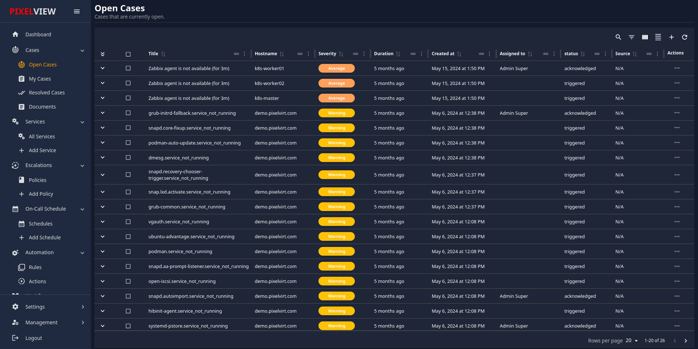
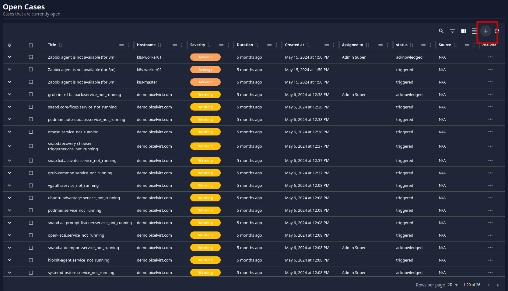
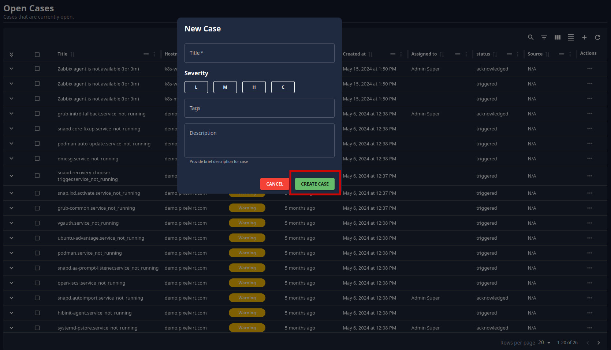
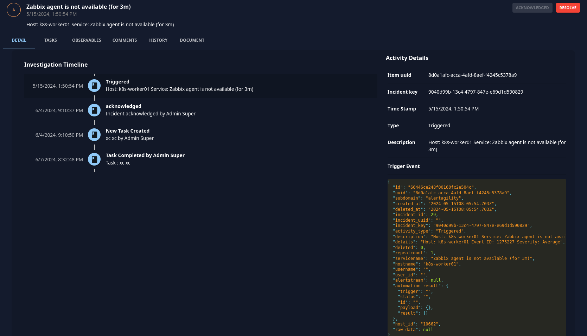
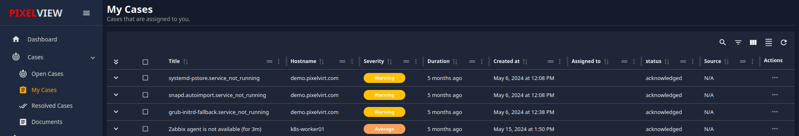
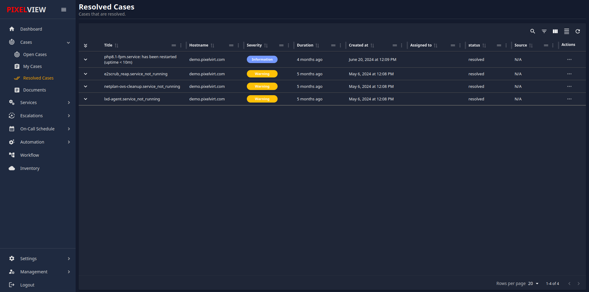
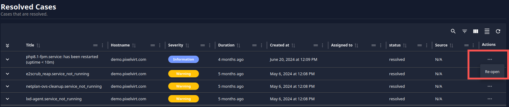
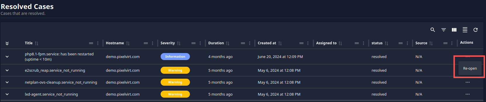

## Overview

The **Cases** section is where you can view and manage all of your alerts. This section provides three categories to help you organize and address issues effectively:

- **Open Cases**
- **My Cases**
- **Resolved Cases**

### Open Cases

In the **Open Cases** section, you can view all newly triggered alerts from various monitoring platforms such as Zabbix, Prometheus, Nagios, etc. This section also allows you to create new cases to ensure all alerts are addressed promptly.

#### Creating a New Case

To create a new case, follow these steps:

1. **Navigate to Open Cases**
    
    - In the **Cases** section, click on **Open Cases** to view all active alerts.
2. **Initiate Case Creation**
    
    - Click on the **+ icon** located in the upper right corner of the Open Cases section. This action will open a popup window for creating a new case.
    

3. **Fill in Case Details**
    
    - In the popup window, provide the following details for the new case:
        - **Case Name:** Enter a descriptive name for the new case.
        - **Severity:** Select the appropriate severity level for the case. The severity levels are:
            - **L** for Low
            - **M** for Medium
            - **H** for High
            - **C** for Critical
        - **Tags:** Add relevant tags to help categorize and filter the case.
        - **Description:** Provide a detailed description of the case, including any pertinent information that will help in resolving the issue.
4. **Create the Case**
    
    - After filling in all the necessary details, click on the **Create Case** button. This will create the new case and add it to the **Open Cases** list.

By following these steps, you can ensure that all alerts are promptly addressed and managed effectively within the Cases section.

## Managing Alerts

In the **Open Cases** section, you can manage your alerts according to your preferences. The available options include:

- **Add Comments**: You can add comments to any alert for better tracking and communication.
- **Acknowledge Alerts**: Mark alerts as acknowledged to indicate that you are aware of them.
- **Manually Resolve Alerts**: Resolve alerts manually if you have addressed the issue.

## **Viewing Alert Details**

By clicking on any alert, you can access a detailed view of that alert. This detailed view offers multiple management options:

- **Assign Tasks**: Assign tasks related to the alert to a specific user.
- **Add Observables**: Include relevant observables to the alert for further analysis.
- **Add or View Comments**: Add new comments or view existing comments for context and updates.
- **View Alert History**: Review the history of the alert to track its progression and any actions taken.

### My Cases

In the **My Cases** section, you can find alerts that are specifically assigned to you. Here, you have the ability to:

- **Acknowledge Cases or Alerts**: This section lists all the cases or alerts assigned to you, allowing you to acknowledge them.
- **View Detailed Information**: By clicking on any alert, you can view comprehensive details about it. This helps you understand the nature and specifics of the alert for better management and resolution.

#### Tasks Management

The **Tasks** section enables you to create, manage, and assign tasks to other users. The functionalities include:

- **Create New Task**: You can create a new task by clicking on the **'TASKS'** button. This will navigate you to the task page.
- **Manage Tasks**: On the task page, you can find all tasks. Here, you have the option to add new tasks.
- **Add New Task**:
    1. Click on the **'Add Task'** button.
    2. Provide the following details:
        - **Task Title**: A brief title for the task.
        - **Description**: A detailed description of the task.
        - **Assign to User or Groups**: Select the user or groups you want to assign the task to.
    3. Click on the **'Create Task'** button to finalize and assign the task.

### Resolved Cases
In the **Resolved Case** section, you can find alerts related to problems that have been fixed or resolved. If you determine that an issue is not actually resolved, you can reopen the case by following these steps:

1. Click on the **'...'** icon located in the last column of the alert.

2. Select **'Re-open'**.

3. The alert will be reopened for further investigation and resolution.