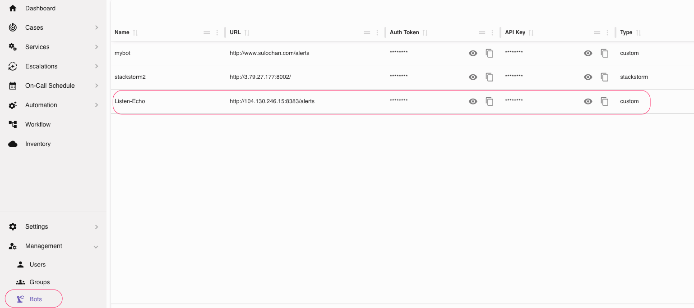
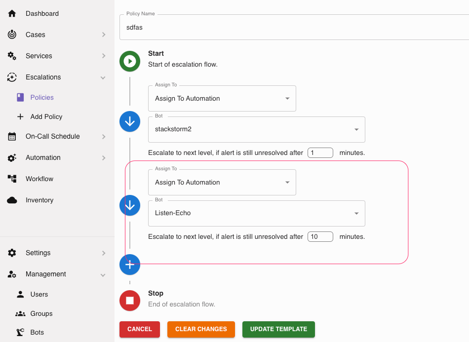

# Custom Bots

Pixelview lets you pass your alert message to external API. This allows us to write scripts or bots
to handle these alerts. This helps us handle a range of different use cases.

Lets take a look at how to do this.

``` shell title="Custom Bot Example Code"
package main

import (
	"bytes"
	"encoding/json"
	"fmt"
	"io/ioutil"
	"log"
	"net/http"
)

// Base URL and credentials for API requests, modify with your user.
var (
	baseURL   = "https://x.x.x.x"
	username  = "sulochan@gmail.com"
	apiKey    = "3bebf0bc-xabc-40f2-9e3e-fb5d5c0ab050"
)

// IncidentActivity represents the structure for posting incident activity
type IncidentActivity struct {
	IncidentKey      string                 `json:"incident_key" bson:"incident_key"`
	ActivityType     string                 `json:"activity_type" bson:"activity_type"`
	Description      string                 `json:"description" bson:"description"`
	Details          string                 `json:"details" bson:"details"`
	ServiceName      string                 `json:"servicename" bson:"servicename"`
	Hostname         string                 `json:"hostname" bson:"hostname"`
	AutomationResult StackstormNotification `json:"automation_result" bson:"automation_result"`
	RawData          interface{}            `json:"raw_data" bson:"raw_data"`
}

type StackstormNotification struct{}

// Comment represents the structure for posting a comment
type Comment struct {
	Body        string `json:"body" bson:"body"`
	TaskUUID    string `json:"task_uuid" bson:"task_uuid"`
	CaseUUID    string `json:"case_uuid" bson:"case_uuid"`
	IncidentKey string `json:"incident_key" bson:"incident_key"`
}

// alertHandler handles incoming requests to /alerts and processes the data
func alertHandler(w http.ResponseWriter, r *http.Request) {
	if r.Method == http.MethodPost {
		// Read the body of the request
		body, err := ioutil.ReadAll(r.Body)
		if err != nil {
			log.Println("Error reading request body:", err)
			http.Error(w, "Unable to read request body", http.StatusBadRequest)
			return
		}
		defer r.Body.Close()

		// Print the received data
		fmt.Printf("Received alert: %s\n", string(body))

		// Parse the JSON body into a map to extract required values
		var msgData map[string]interface{}
		if err := json.Unmarshal(body, &msgData); err != nil {
			log.Println("Invalid JSON format:", err)
			http.Error(w, "Invalid JSON format", http.StatusBadRequest)
			return
		}

		// Extract incident key from the message
		incidentKey, ok := msgData["incident_key"].(string)
		if !ok {
			log.Println("Incident key not found in the message")
			http.Error(w, "Incident key not found in the message", http.StatusBadRequest)
			return
		}

		// Extract other values from the msgData as necessary, using default values if not found
		serviceName := "Unknown Service"
		if val, ok := msgData["service_name"].(string); ok {
			serviceName = val
		}

		hostname := "Unknown Host"
		if val, ok := msgData["hostname"].(string); ok {
			hostname = val
		}

		// Create an instance of IncidentActivity
		incidentActivity := IncidentActivity{
			IncidentKey:  incidentKey,
			ActivityType: "Automation: Received",                 // Static value for this example
			Description:  "An alert was received and processed.", // You can modify this based on message details
			Details:      string(body),                           // Store the full message in Details
			ServiceName:  serviceName,                            // Extracted from message
			Hostname:     hostname,                               // Extracted from message
			RawData:      msgData,                                // Store raw message data
		}

		// Post the IncidentActivity to the specified URL
		postURL := fmt.Sprintf("%s/api/alerts/%s/activities", baseURL, incidentKey)
		err = postIncidentActivity(postURL, incidentActivity)
		if err != nil {
			log.Println("Failed to post to external API:", err)
			http.Error(w, fmt.Sprintf("Failed to post to external API: %v", err), http.StatusInternalServerError)
			return
		}

		// Post a comment after the incident activity
		commentBody := `This is a multi line comment.
This is line 2.
Line 3 ... and so on.`
		comment := Comment{
			Body:        commentBody,
			IncidentKey: incidentKey,
		}
		err = postComment(fmt.Sprintf("%s/api/comment_create", baseURL), comment)
		if err != nil {
			log.Println("Failed to post comment:", err)
			http.Error(w, fmt.Sprintf("Failed to post comment: %v", err), http.StatusInternalServerError)
			return
		}

		// Respond back to the client
		w.WriteHeader(http.StatusOK)
		w.Write([]byte("Alert received and processed, comment added"))
	} else {
		log.Println("Invalid request method:", r.Method)
		http.Error(w, "Invalid request method", http.StatusMethodNotAllowed)
	}
}

// postIncidentActivity posts the incident activity to the external API
func postIncidentActivity(url string, activity IncidentActivity) error {
	data, err := json.Marshal(activity)
	if err != nil {
		log.Println("Failed to marshal incident activity:", err)
		return fmt.Errorf("failed to marshal incident activity: %w", err)
	}

	req, err := http.NewRequest("POST", url, bytes.NewBuffer(data))
	if err != nil {
		log.Println("Failed to create request:", err)
		return fmt.Errorf("failed to create request: %w", err)
	}

	req.Header.Set("Content-Type", "application/json")
	req.Header.Set("X-Username", username)   // Use the username variable
	req.Header.Set("X-API-Key", apiKey)      // Use the apiKey variable

	client := &http.Client{}
	resp, err := client.Do(req)
	if err != nil {
		log.Println("Failed to send request:", err)
		return fmt.Errorf("failed to send request: %w", err)
	}
	defer resp.Body.Close()

	if resp.StatusCode != http.StatusOK {
		log.Println("Received non-OK response code:", resp.StatusCode)
		return fmt.Errorf("received non-OK response code: %d", resp.StatusCode)
	}

	return nil
}

// postComment posts a comment to the external API
func postComment(url string, comment Comment) error {
	data, err := json.Marshal(comment)
	if err != nil {
		log.Println("Failed to marshal comment:", err)
		return fmt.Errorf("failed to marshal comment: %w", err)
	}

	req, err := http.NewRequest("POST", url, bytes.NewBuffer(data))
	if err != nil {
		log.Println("Failed to create request:", err)
		return fmt.Errorf("failed to create request: %w", err)
	}

	req.Header.Set("Content-Type", "application/json")
	req.Header.Set("X-Username", username)   // Use the username variable
	req.Header.Set("X-API-Key", apiKey)      // Use the apiKey variable

	client := &http.Client{}
	resp, err := client.Do(req)
	if err != nil {
		log.Println("Failed to send request:", err)
		return fmt.Errorf("failed to send request: %w", err)
	}
	defer resp.Body.Close()

	if resp.StatusCode != http.StatusOK {
		log.Println("Received non-OK response code for comment:", resp.StatusCode)
		return fmt.Errorf("received non-OK response code for comment: %d", resp.StatusCode)
	}

	return nil
}

func main() {
	// Register the /alerts route with alertHandler
	http.HandleFunc("/alerts", alertHandler)

	// Start the server on port 8383
	port := ":8383"
	fmt.Printf("Server is listening on port %s...\n", port)
	log.Fatal(http.ListenAndServe(port, nil))
}
```
Build and run this code will create a http server that listens on port 8383. Now, in order to use this, we simply
create a new bot from settings and use it in our escalation path.



Once the bot is created assign it to your escalation path.



Now, every alert that comes in through any service that is using this escalation policy, will receive the alert.
This will allow the bot to do custom work and take action on the alerts.
