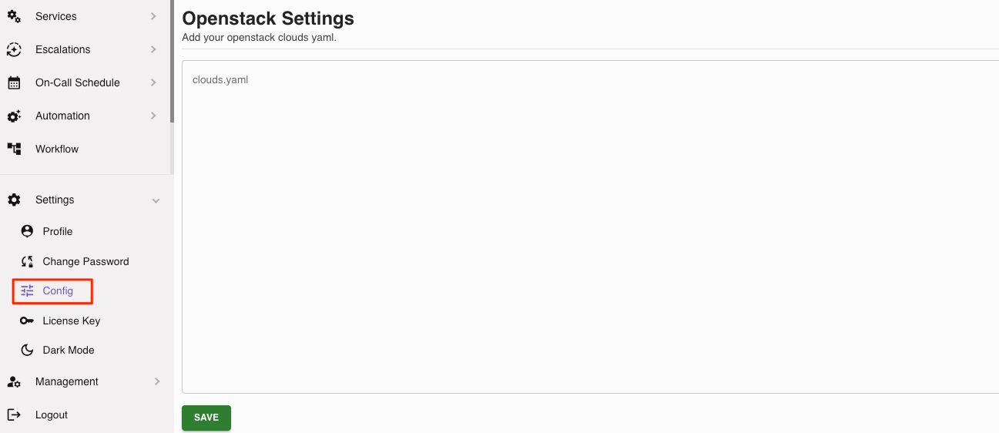

PixelView allows users to consolidate multiple cloud platforms into one palce.

Currently we support: Openstack and Kubernetes
Coming Soon: VMWare Integration

**Adding Openstack Cloud(s)**

1. Go to your Settings and click on Config -> Openstack Settings

2. Put your cloud.yaml data (single or multiple cloud)

3. Save the settings

4. Under Cloud Dashboard, you will now see your OpenStack cloud(s) appear

**Adding Kubernetes Clusters**

1. Go to your Settings and click on Config -> Kubernetes Settings

2. Put your kubeconfig.yaml data (single or multiple cluster)

3. Save the settings

4. Under Cloud Dashboard, you will now see your Kubernetes cluster(s) appear
