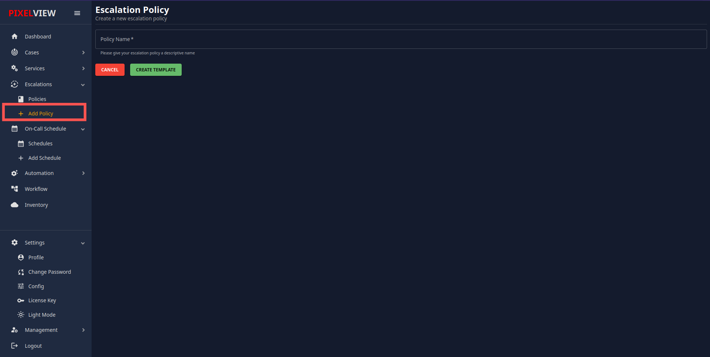
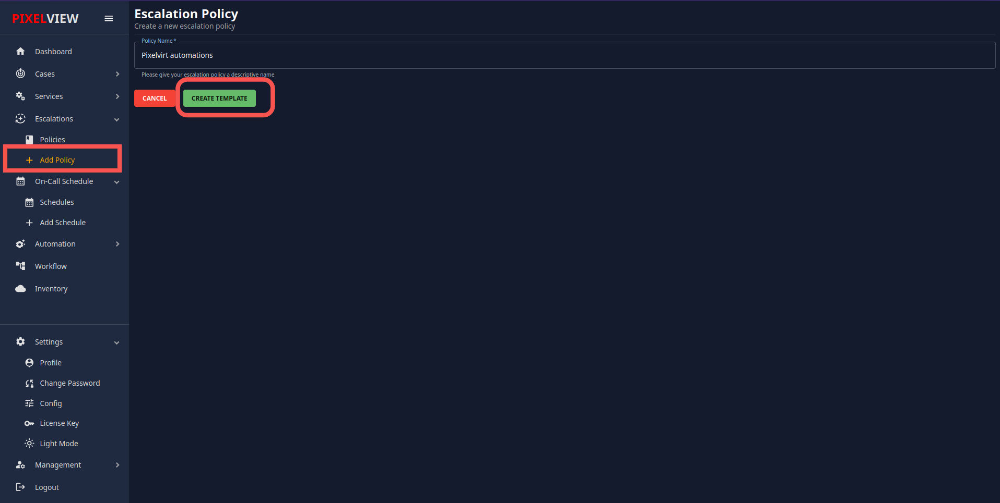
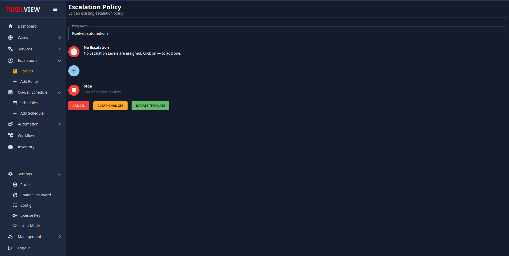
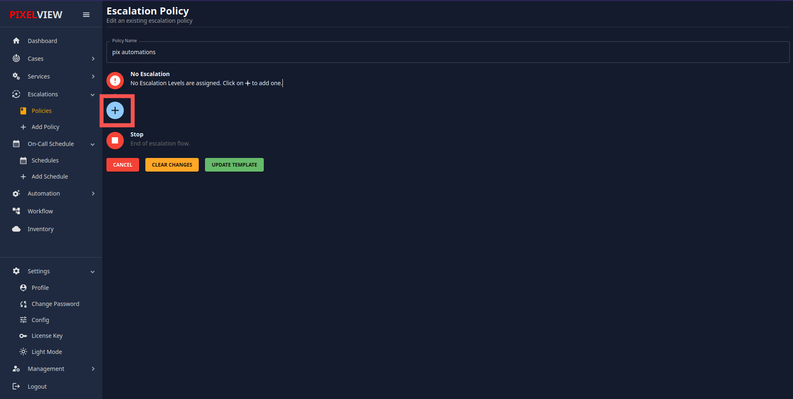
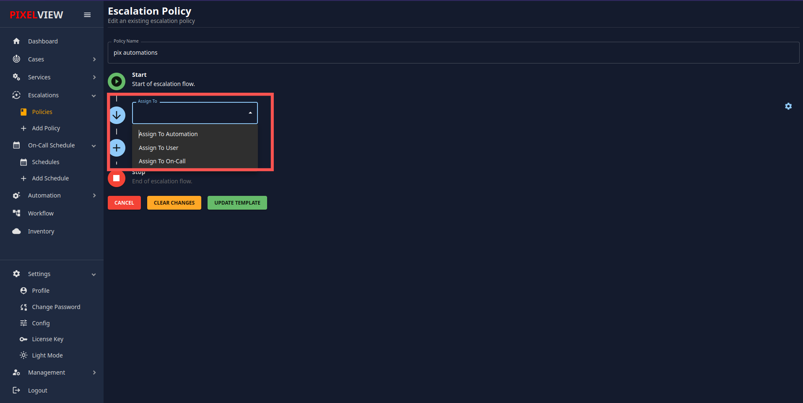
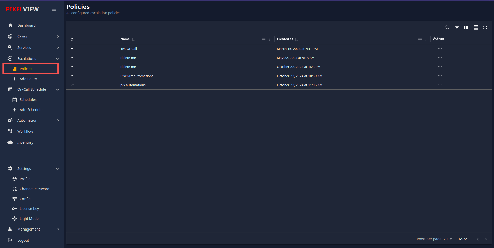
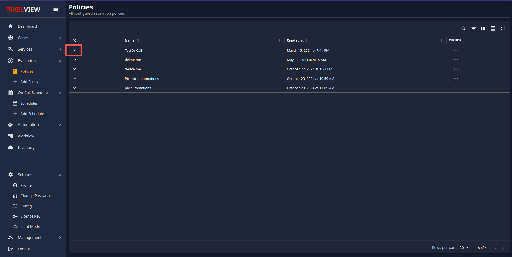

# Escalation Policy 
An Escalation Policy is a defined protocol that ensures alerts are addressed promptly and efficiently. It outlines the steps and responsible parties involved in escalating an issue until it is resolved. The policy typically includes multiple levels of escalation, specifying how and when the alert should move to the next level if it remains unresolved.

#### Creating a New Escalation Policy

To create a new Escalation Policy, follow these steps:

1. **Accessing the New Policy Page:**

    - Click on the 'Add Policy' option.
    - You will be redirected to the New Escalation Policy creation page.
    

2. **Naming the Policy:**
    
    - Provide a name for the new policy.
    - Click on the "Create Template" button.
    

3. **Editing the Policy:**
    
    - You will be redirected to the policy edit page.
    - Here, you can add different levels to the policy.
    

4. **Adding Escalation Levels:**
    
    - To add a new level of escalation, click on the '+' icon.
    
    - You will see three drop-down options:
    
        - **Assign to Automations:** Select this option if you want to assign the alert to an automation bot. You must select a bot that has been previously created. If no bots are available, refer to the management section for detailed instructions on creating one.
        - **Assign to User:** Select this option to assign the alert to a specific user.
        - **Assign to On-call:** Select this option to assign the alert to an on-call schedule. The on-call team members will handle the alert based on the schedule.

5. **Configuring Escalation Timing:**
    
    - Adjust the value for "Escalate to next level" to specify the time (in minutes) after which the alert should escalate if unresolved. The default is set to 10 minutes.
    [Escalation Timing](pix-images/Escalation-Timing.png)
    - Add additional levels of escalation as required.

6. **Saving the Policy:**
    
    - After configuring all parameters, click on the "Update Template" button to save the policy.

## Policies Management 
### Overview
In this section, you will find information about how to manage policies within the application. This includes viewing, editing, and deleting policies. Policies can be used for various services according to your requirements.

### Accessing Policies

To access the Policies section:
1. Navigate to the main menu and select "Policies."

2. Here, you will see a list of all the policies that you have created.

### Viewing Policies

#### Policy List

- All created policies are displayed in a table format.
- Each row represents a single policy, with details such as the policy name, description, and associated services.

#### Viewing Services Using a Policy

- In the first column of the policy list, there is a 'V' button for each policy.
- Click the 'V' button to expand the view and see which services are currently using that escalation policy.

s
#### Managing Policies:    
- The **Action Menu (...)** in the last column provides options for editing and deleting policies.
        - **Edit:** Clicking "Edit" allows you to modify the existing policy configuration.
        - **Delete:** Clicking "Delete" permanently removes the selected policy. Use caution when deleting policies, as it may affect services that rely on it.