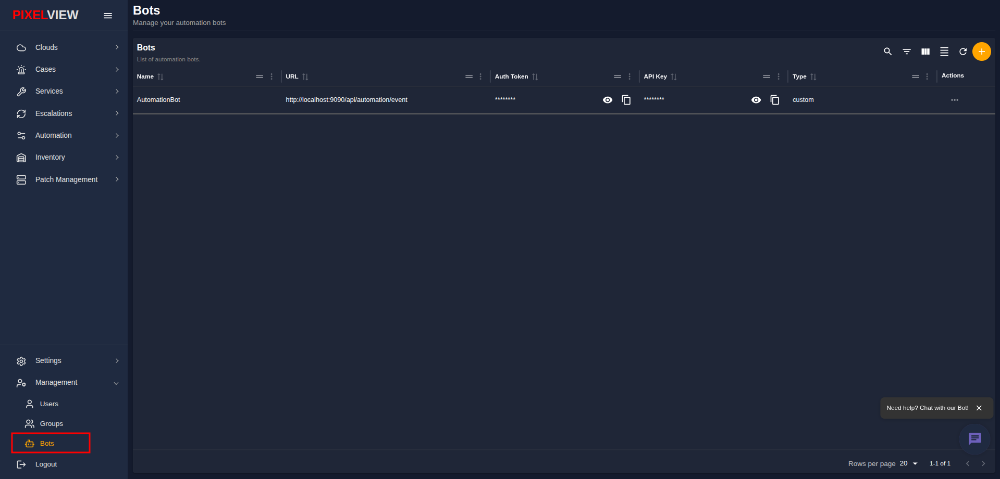
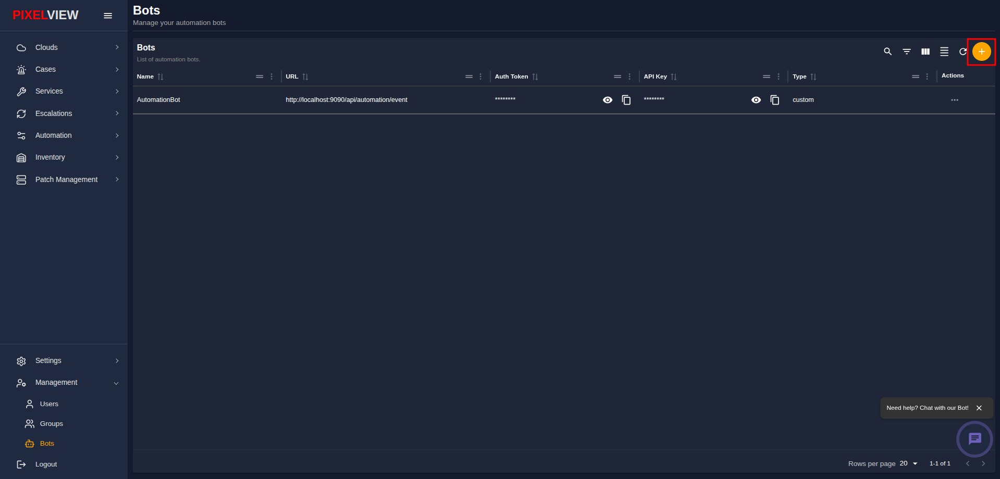
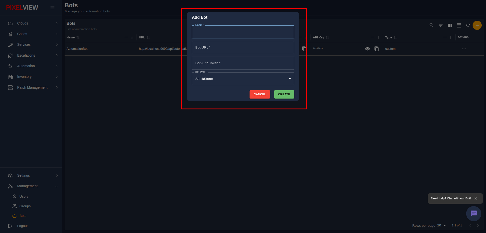
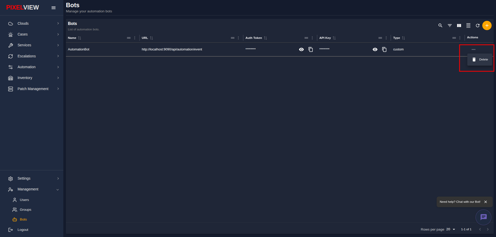

# Automation Bots

The **Bots** section (`/bots`) in PixelView manages automation bots and automated webhook endpoints. These bots execute automated remediation workflows, trigger external actions, and handle alert escalation levels without requiring human intervention.

---

## 1. Viewing Automation Bots

Navigate to **Management** > **Bots** from the left navigation sidebar:

The bots table provides an inventory of all configured automation bots:

| Column | Description |
| :--- | :--- |
| **Name** | Display name identifying the bot. |
| **URL** | Fully qualified endpoint URL where the bot service listens for events and payloads. |
| **Auth Token** | Authentication token used by PixelView to authenticate outgoing requests to the bot endpoint. Masked with confidential toggle & copy controls. |
| **API Key** | System-generated API key assigned to the bot. Masked with confidential toggle & copy controls. |
| **Type** | Bot execution engine type:   • `StackStorm` — Connects to a StackStorm automation action runner.   • `Custom` — Custom webhook handler or script integration. |
| **Actions** | Context menu (`...`) allowing administrators to **Delete** the bot. |

#### Table Toolbar Controls
* **Search / Global Filter**: Search across bot names, types, and URLs.
* **Toggle Column Filters**: Filter specific columns.
* **Show/Hide Columns**: Customize visible headers in the table.
* **Density Toggle**: Toggle between compact and relaxed row height.
* **Refresh**: Fetch the latest bot list from the server.
* **Add Bot (`+`)**: Open the bot creation modal.

---

## 2. Adding a New Bot

To register a new automation bot in PixelView:

1. Click the **`+`** (Add Bot) button in the top-right corner of the table toolbar:
   
2. The **Add Bot** modal dialog will open:
   
3. Fill in the required parameters:
   * **Name** *(Required)*: A unique name for your bot (e.g., `StackStorm Runner`, `Disk Cleanup Bot`).
   * **Bot URL** *(Required)*: The fully qualified URL or IP endpoint where the bot can be reached.
   * **Bot Auth Token** *(Required)*: The secret token used for payload verification.
   * **Bot Type** *(Required)*: Select the bot engine from the dropdown:
     * **StackStorm**: Standard StackStorm automation integration.
     * **Custom**: Custom webhook endpoint or custom automation bot.
4. Click **Create** (shows *Creating...* while registering).

---

## 3. Managing Bot Secrets & Actions

### Viewing and Copying Tokens
Both the **Auth Token** and **API Key** columns use security masking by default (`••••••••`):
* Click the **Eye Icon** to temporarily reveal the plaintext token.
* Click the **Copy Icon** to copy the token directly to your clipboard.

### Deleting a Bot
1. In the Bots table, click the **`...`** icon under the **Actions** column for the target bot.
2. Select **Delete** (Trash Icon):
   
3. Confirm the deletion prompt (`Are you sure you want to delete <Bot Name>?`).
4. The bot will be permanently detached and removed from the system.

---

## 4. Using Bots in Escalation Policies

Once registered, bots can be automatically assigned to alert escalation workflows:
* In **Escalations** > **Policies**, you can add an escalation level and choose **Assign to Automations**.
* Select the desired bot from the dropdown. When an unresolved incident reaches this escalation tier, PixelView automatically dispatches the alert payload to the bot's configured endpoint.