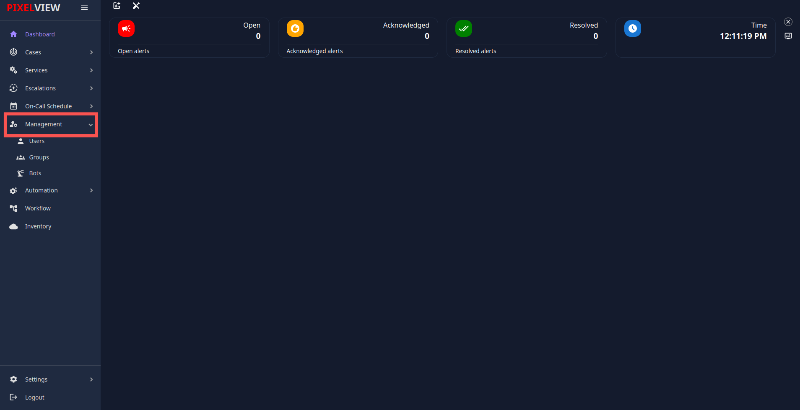
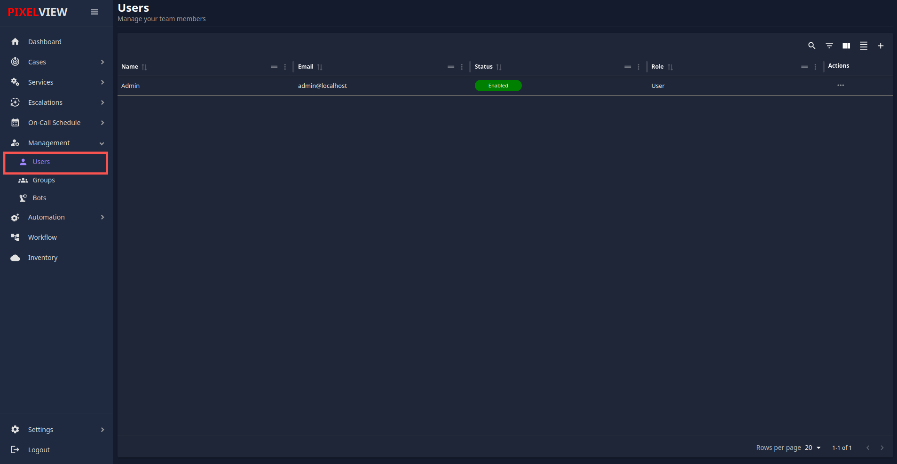
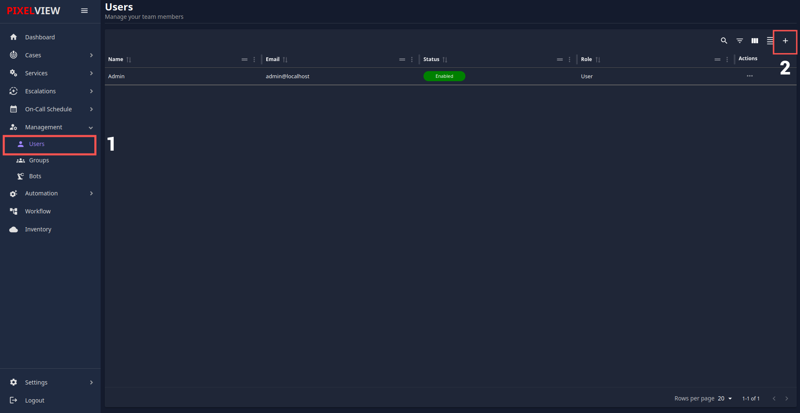
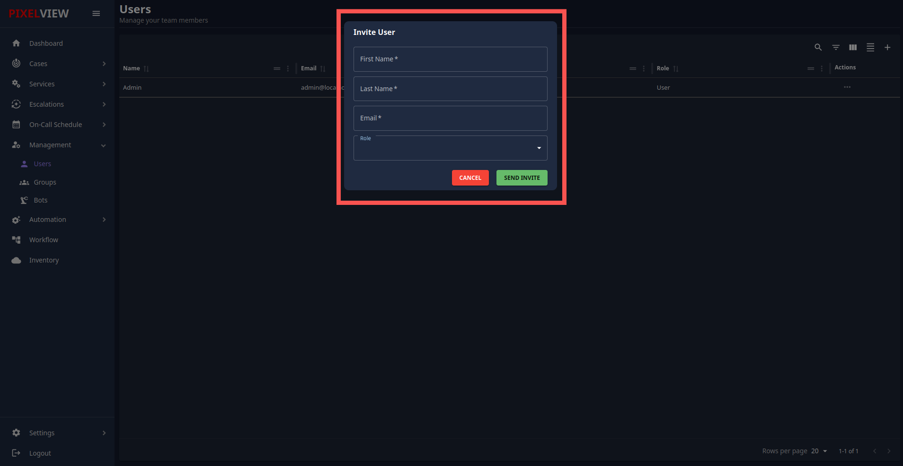
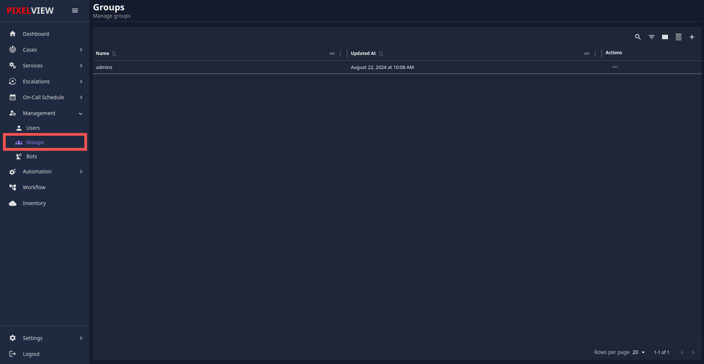
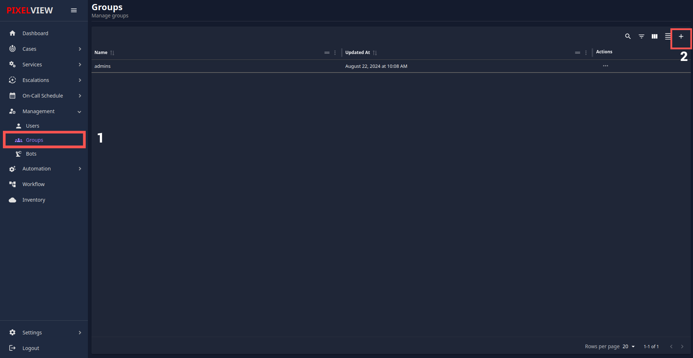

## management

The **Management** section in PixelView is the hub for administering users, groups, and automation bots. Below is a detailed guide on the various subsections within **Management**.

## 1. **Users**

The **Users** section allows you to manage user accounts. Follow the steps below to view, add, and manage users.

### **Viewing Users**

1. Click on **Users** from the side menu under the **Management** section.

2. A list of all registered users will be displayed, showing details like name, email, and role.

### **Adding a New User**

1. To invite a new user, click on the **"+"** icon at the top-right corner.

2. A popup labeled **Invite User** will appear. Fill out the following fields:

    - **First Name**: Enter the first name of the user.
    - **Last Name**: Enter the last name of the user.
    - **Email**: Enter a valid email address. This email will be used for sending the invitation.
    - **Role**: Select the user's role from the dropdown. Available options are:
        - **Admin**
        - **User**
3. After filling in the details, click the **Send Invite** button.
4. The user will receive an invitation email with their username and password to log into the platform.

---

## 2. **Groups**

The **Groups** section is designed to manage user groups for access control and permissions.

### **Viewing Groups**

1. Click on **Groups** from the side menu under **Management**.

2. You will see a list of existing groups, including details about group members and roles.

### **Creating a New Group**

1. To create a new group, click on the **"+"** icon at the top-right corner.

2. A popup will appear prompting you to name the group and select members to add.
3. After assigning members, click **Create** to finalize the new group.

### **Editing a Group**

1. Click on the group name from the list.
2. You can add/remove members or change group permissions.
3. Click **Save** to apply the changes.

---

## 3. **Bots**

The **Bots** section allows you to manage automation bots within the system.

### **Viewing Bots**

1. Click on **Bots** from the side menu under **Management**.
2. You will see a list of existing bots with columns for:
    - **Name**: The name of the bot.
    - **URL**: The bot’s endpoint URL.
    - **Auth Token**: The authentication token for accessing the bot.
    - **API Key**: The API key associated with the bot.
    - **Type**: The type of bot (e.g., automation, alerting, etc.).

### **Adding a New Bot**

1. To create a new bot, click on the **"+"** icon at the top-right corner.
2. A form will appear, prompting you to fill in details such as:
    - **Name**: Name of the bot.
    - **URL**: The endpoint URL for the bot.
    - **Auth Token**: Provide the token for authentication.
    - **API Key**: If required, enter the bot’s API key.
3. Once completed, click **Create Bot** to add it to the list.

### **Managing Bots**

- You can edit or delete bots using the action buttons in the **Actions** column.
---
This documentation provides a structured process for managing **Users**, **Groups**, and **Bots** in the PixelView platform, as illustrated in the interface.