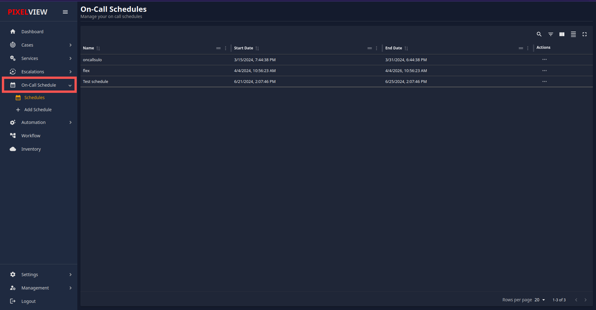
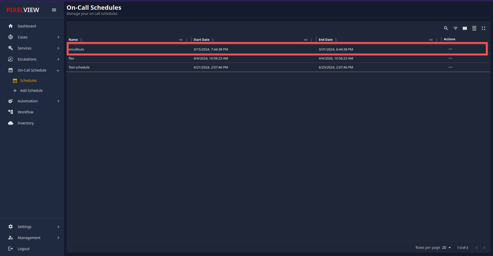

### Schedules
## Overview

The On-Call Schedule feature in PixelView allows users to view and manage all on-call schedules efficiently. This functionality helps teams keep track of who is on call and when, ensuring smooth operations and prompt incident response.

## Accessing On-Call Schedules

To view all on-call schedules, follow these steps:

1. **Log in to PixelView**: Ensure you are logged into your PixelView account.
    
2. **Navigate to the On-Call Schedule**:
    
    - Locate and click on the **On-Call Schedule** button on the main dashboard.
3. **Open Schedule Options**:
    
    - From the dropdown menu, click on **Schedule Options**.
    

## Viewing Schedules

After selecting **Schedule Options**, you will see a list of all schedules available. The list includes the following details for each schedule:

- **Schedule Name**: The name assigned to the schedule.
- **Start Date**: The date when the schedule begins.
- **End Date**: The date when the schedule ends.
- **Action Options**: Options for editing or deleting the schedule.

## Action Options

For each schedule listed, you will find action options that allow you to manage the schedules:

1. **Edit**: Click the **Edit** button to modify the details of the selected schedule.
2. **Delete**: Click the **Delete** button to remove the selected schedule from the system.

### Editing a Schedule

- Upon clicking **Edit**, you will be directed to a form where you can update the schedule name, start date, end date, and other relevant details.
- After making the necessary changes, ensure to save the updates.

### Deleting a Schedule

- Clicking **Delete** will prompt a confirmation dialog to ensure you want to proceed with deleting the schedule.
- Confirm the deletion to remove the schedule permanently.

## Viewing Detailed Schedule Information

To view the on-call schedule details for a particular schedule:

1. Click on the specific schedule name in the list.

2. The detailed on-call schedule will display, showing the current calendar and indicating which users or teams are assigned for on-call duties.

### Calendar View

- The calendar view will present the current month and highlight the dates where users or teams are assigned to be on call.
- Assigned individuals will be clearly marked on their respective dates.

### Adding Users to the Schedule

You can also add users to the on-call schedule by following these steps:

1. **Select a Date**: Click on the date in the calendar when you want to assign an on-call duty.
    
2. **Assign User**: A dialog or form will appear, allowing you to select the user or team you wish to assign for that date.
    
3. **Save Assignment**: After selecting the appropriate user, confirm and save the changes to update the on-call schedule.
    

## Conclusion

The On-Call Schedule feature in PixelView is designed to enhance operational efficiency by providing an intuitive interface for managing on-call duties. By following the steps outlined above, users can easily navigate through the scheduling options, edit or delete schedules, view detailed on-call information, and add users to the schedule.