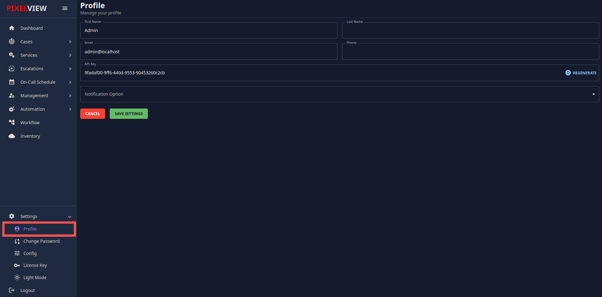
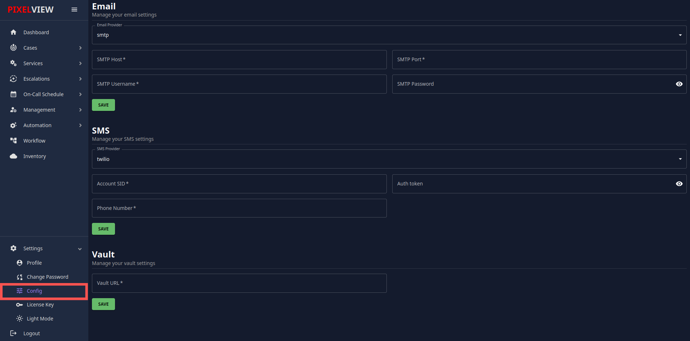
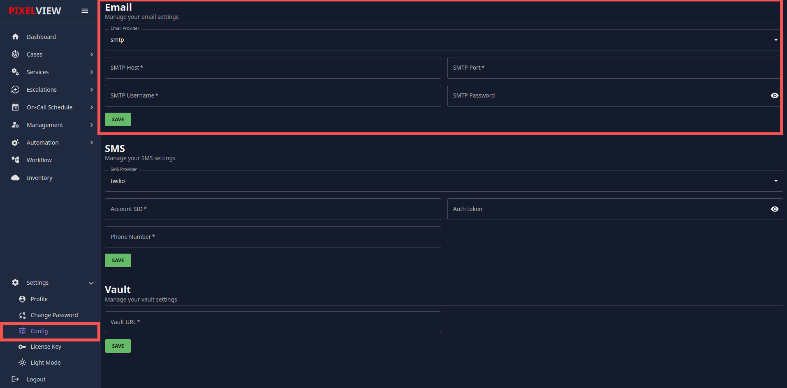
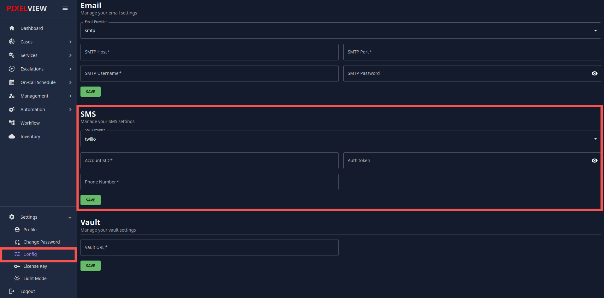
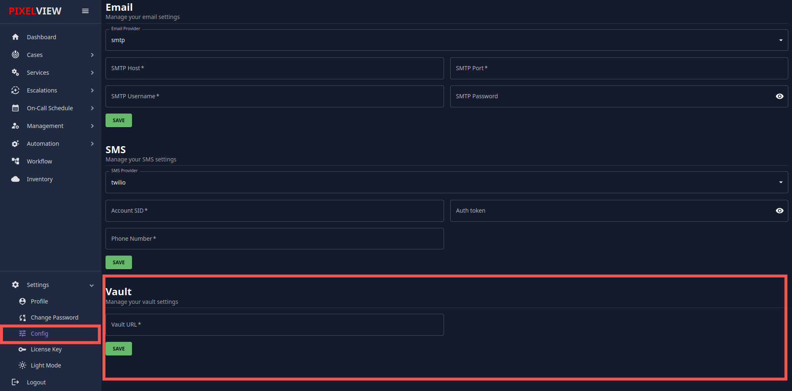
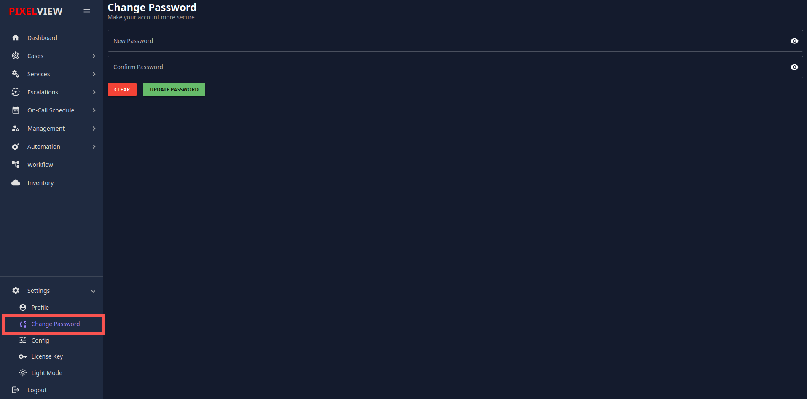
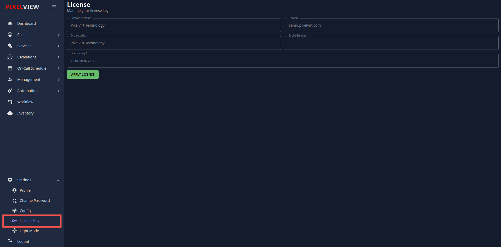
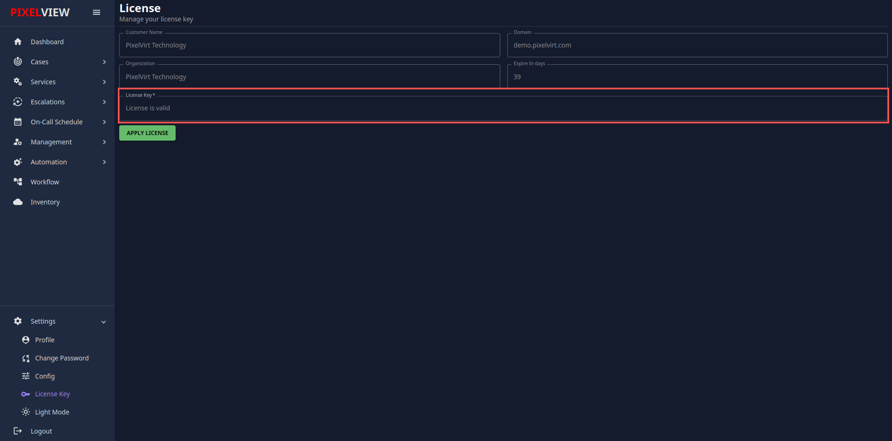

The **Settings** section allows users to manage various aspects of their account and customize their experience within Pixelview. The following options are available:

## 1. Profile Section

The **Profile** section allows users to manage their personal account details and related settings, including API keys and notification preferences.

### Features:

- **First Name**:  
    Enter or edit the first name associated with the user account.
    
- **Name**:  
    Input your full name or preferred display name, which might be used across various parts of the application.
    
- **API Key**:  
    This field shows the current API key used to authenticate your account with external services.
    
    - **Regenerate**: Create a new API key if the current one is compromised or outdated.
- **Notification Options**:  
    Choose how you'd like to receive notifications:
    
    - **Email**: Receive notifications via email.
    - **SMS**: Get notifications via text message on your phone.
    - **Email & SMS**: Receive notifications through both email and SMS for better visibility.

### Actions:

- **Save**:  
    Click the **Save** button to apply changes made to your profile details.

---

## 2. Configuration Section

This section allows you to configure various services such as email, SMS, and vault settings for your account.

### Email Configuration:

This section allows users to set up email communication by configuring SMTP settings.

- **Email Provider**:  
    Select the email provider (e.g., SMTP).
    
- **SMTP Host**:  
    Enter the SMTP server host (e.g., smtp.gmail.com).
    
- **SMTP Port**:  
    Enter the port number used for the SMTP connection (e.g., 465 or 587).
    
- **SMTP Username**:  
    Provide the username or email address for the SMTP server.
    
- **SMTP Password**:  
    Input the password for the SMTP server.
    

### SMS Configuration:

This section allows users to set up SMS notifications using an SMS service provider like Twilio.

- **SMS Provider**:  
    Select your SMS provider (e.g., Twilio).
    
- **Account SID**:  
    Enter your Twilio Account SID.
    
- **Phone Number**:  
    Input the phone number you want to use to send or receive SMS notifications.
    
- **Auth Token**:  
    Provide the authentication token required by the SMS service.
    

### Vault Configuration:

This section is used to manage secure vault settings where sensitive information is stored.

- **Vault URL**:  
    Input the URL of the vault server where secure data is stored.

### Actions:

- **Save**:  
    Click **Save** to apply changes to email, SMS, or vault configurations.

---

## 3. Change Password Section

The **Change Password** section allows users to update their account password to ensure the security of their account.

- **New Password**:  
    Enter a new password for your account.
    
- **Confirm Password**:  
    Re-enter the new password to confirm that both entries match.
    

### Actions:

- **Clear**:  
    Click the **Clear** button to reset the input fields if needed.
    
- **Update Password**:  
    Click the **Update Password** button to change your password. Make sure the two password fields match before submitting.
    

---
## 4. License

The **License** section allows users to apply an existing license key or request a new one to activate the application.

- **Apply License Key**:  
    If you already have a valid license key, follow these steps:
    
    1. Navigate to the **License** section within **Settings**.
    
        
    2. Enter or paste your license key into the provided field.
    
        
    3. Click the **Apply License** button.
        
    
    - If the license key is valid, a message saying **"License applied successfully"** will appear, confirming activation.
    - If the license key is invalid or expired, you will receive an error message asking you to check the key or contact support.

- **Request License**:  
    If you do not have a license key, you can request one by:
    
    1. Clicking the **Request License** button inside the **License** section.
    2. Following the instructions to complete the license request form.
    
    A new license key will be issued, and you can apply it following the steps above.
    

### License Types:

- **License Type**:  
    Depending on your application usage, the license may allow different levels of functionality such as free, premium, or enterprise tiers.

### License Validity:

- Ensure that your license is always up-to-date to avoid service interruptions.
- License renewal or extension can be requested if needed.
---

## Conclusion

By following the steps outlined in this document, users can easily manage their profiles, configure email and SMS notifications, update their password, and manage vault settings securely. Always ensure that sensitive data like API keys and passwords are handled properly for maintaining account security.